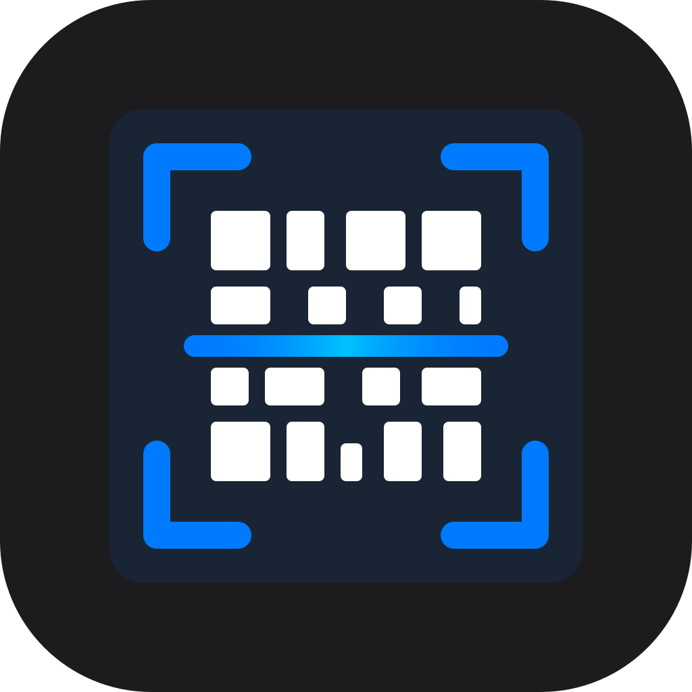

# CodeSnap - Barcode Scanner

A modern, feature-rich barcode scanner application built with React Native and Expo. Scan multiple barcode formats, manage scan history, and customize settings to fit your workflow.



## Features

- **Multi-Format Support**: Scan QR codes, UPC, EAN, Code 128, Code 39, and more
- **Scan History**: Keep track of all your scans with expandable details
- **Smart Duplicate Prevention**: Prevents duplicate scans on iOS devices
- **Auto-Resume**: Configurable auto-resume with customizable delay
- **Copy to Clipboard**: Automatically copy scanned values
- **URL Detection**: Automatically detect and open web links
- **Torch Control**: Built-in flashlight for scanning in low light
- **Haptic Feedback**: Tactile confirmation on successful scans
- **Dark Mode UI**: Sleek dark interface optimized for all lighting conditions

## Screenshots

<div align="center">
  <i>Coming soon</i>
</div>

## Getting Started

### Prerequisites

- Node.js (v18 or later)
- npm or yarn
- Expo CLI
- iOS Simulator (Mac only) or Android Emulator
- Physical device for testing camera features

### Installation

1. Clone the repository:
```bash
git clone https://github.com/Fybre/codesnap-barcode-scanner.git
cd codesnap-barcode-scanner
```

2. Install dependencies:
```bash
npm install
```

3. Start the development server:
```bash
npx expo start
```

4. Run on your device:
   - Scan the QR code with the Expo Go app (iOS/Android)
   - Press `i` for iOS Simulator
   - Press `a` for Android Emulator

## Building for Production

### Using EAS Build (Recommended)

1. Install EAS CLI:
```bash
npm install -g eas-cli
```

2. Log in to your Expo account:
```bash
eas login
```

3. Build for production:

**Android (APK):**
```bash
eas build --platform android --profile production
```

**iOS:**
```bash
eas build --platform ios --profile production
```

**Both platforms:**
```bash
eas build --platform all --profile production
```

Builds will be available at [expo.dev](https://expo.dev) when complete.

## Supported Barcode Formats

- **QR Code**
- **Aztec**
- **Codabar**
- **Code 39**
- **Code 93**
- **Code 128**
- **Data Matrix**
- **EAN-8**
- **EAN-13**
- **ITF-14**
- **PDF417**
- **UPC-A**
- **UPC-E**

## Configuration

### Settings

Access settings from the Settings tab to customize:

- **Enabled Barcode Types**: Toggle which barcode formats to scan
- **Auto-Resume Scanning**: Automatically resume scanning after a delay
- **Auto-Resume Delay**: Customize the delay (1-10 seconds)
- **Auto Copy to Clipboard**: Automatically copy scanned values

### App Configuration

Edit `app.json` to customize:
- App name and slug
- Bundle identifiers
- Icon and splash screen
- Other Expo configuration options

## Project Structure

```
codesnap-barcode-scanner/
├── app/
│   ├── (tabs)/
│   │   ├── index.tsx          # Main scanner screen
│   │   ├── settings.tsx       # Settings screen
│   │   └── _layout.tsx        # Tab navigation layout
│   ├── about.tsx              # About screen
│   └── _layout.tsx            # Root layout
├── assets/
│   └── images/                # App icons and images
├── context/
│   └── AppContext.tsx         # Global app state management
├── types/
│   └── barcode.ts             # TypeScript type definitions
├── app.json                   # Expo configuration
├── eas.json                   # EAS Build configuration
└── package.json               # Dependencies
```

## Technologies Used

- **React Native**: Cross-platform mobile framework
- **Expo**: Development platform and build system
- **Expo Camera**: Camera API with barcode scanning
- **Expo Router**: File-based navigation
- **TypeScript**: Type-safe development
- **AsyncStorage**: Persistent local storage

## Contributing

Contributions are welcome! Please feel free to submit a Pull Request.

## License

This project is licensed under the MIT License - see the LICENSE file for details.

## Author

**Craig** - [fybre.me](https://fybre.me)

## Acknowledgments

- Built with [Expo](https://expo.dev)
- Icons from [Ionicons](https://ionic.io/ionicons)
- Developed with assistance from Claude (Anthropic)

## Support

For issues, questions, or suggestions, please open an issue on [GitHub](https://github.com/Fybre/codesnap-barcode-scanner/issues).

---

Made with ❤️ using React Native and Expo
